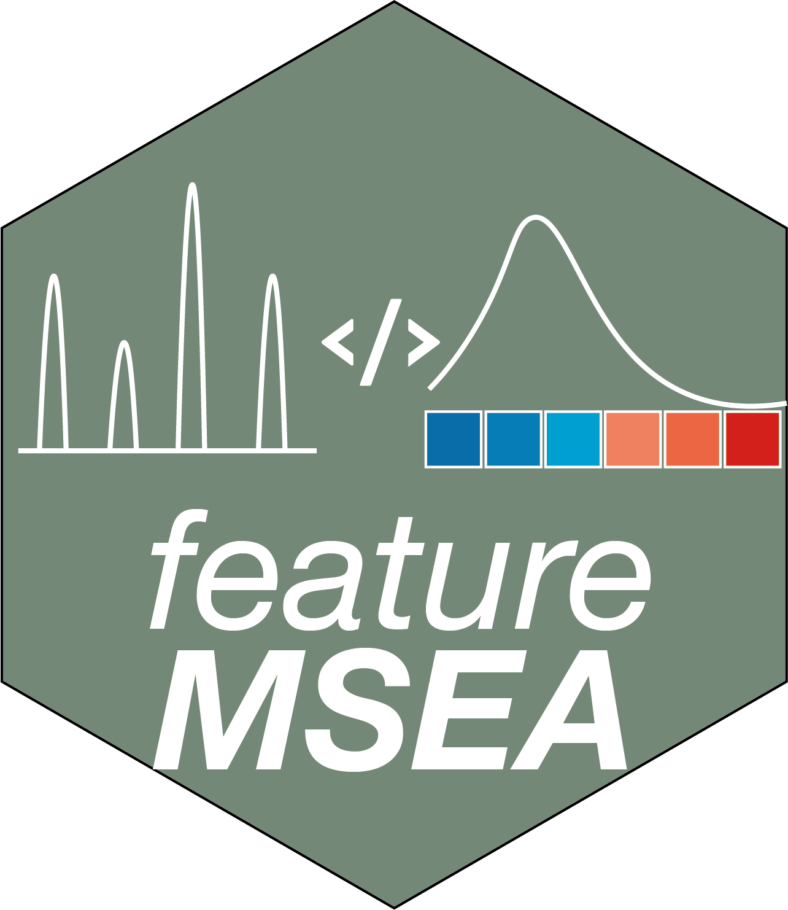

<!-- README.md is generated from README.Rmd. Please edit that file -->

# fMSEA 

[](https://cran.r-project.org/package=fmsea)
[](https://github.com/tidymass/fmsea)
[](https://cran.r-project.org/package=fmsea)
[](https://www.tidyverse.org/lifecycle/#experimental)


`fmsea` is a part of [tidymass](https://tidymass.github.io/tidymass/)

-------

# About

`fmsea` is a R package which is used for metabolic feature based metabolite set enrichment analysis.


# Installation

You can install `fmsea` from [GitLab](https://gitlab.com/jaspershen/fmsea)

``` r
if(!require(remotes)){
install.packages("remotes")
}
remotes::install_gitlab("jaspershen/fmsea")
```
or [Github](https://github.com/tidymass/fmsea)

``` r
remotes::install_github("tidymass/fmsea")
```

`fmsea` is a part of `tidymass`, so you can also install it by installing [`tidymass`](https://www.tidymass.org/).

# Usage

Please see the `Help documents` page to get the instruction of `fmsea`.

## Need help?

If you have any questions about `fmsea`, please don’t hesitate to email me (<shenxt@stanford.edu>).

<i class="fa fa-weixin"></i>
[shenzutao1990](https://www.shenxt.info/files/wechat_QR.jpg)

<i class="fa fa-envelope"></i> <shenxt@stanford.edu>

<i class="fa fa-twitter"></i>
[Twitter](https://twitter.com/JasperShen1990)

<i class="fa fa-map-marker-alt"></i> 
[M339, Alway Buidling, Cooper Lane, Palo Alto, CA 94304](https://www.google.com/maps/place/Alway+Building/@37.4322345,-122.1770883,17z/data=!3m1!4b1!4m5!3m4!1s0x808fa4d335c3be37:0x9057931f3b312c29!8m2!3d37.4322345!4d-122.1748996)

# Citation

If you use `fmsea` in your publications, please cite this paper:

Xiaotao Shen\* (Corresponding Author)

fmsea: A R package for automatable compound annotation for LC−MS-based data

and 

TidyMass: An Object-oriented Reproducible Analysis Framework for LC-MS Data.

Xiaotao Shen, Hong Yan, Chuchu Wang, Peng Gao, Caroline H. Johnson, Michael P. Snyder.

[Web Link](https://www.biorxiv.org/content/10.1101/2022.03.15.484499v1).

Thanks very much!
